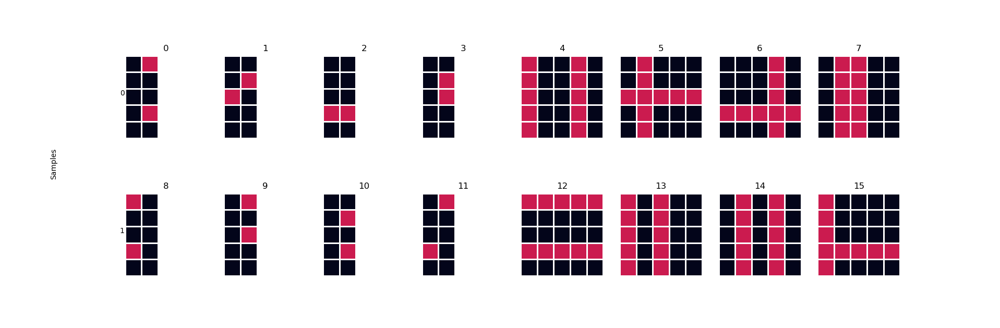

<div align="center">

# Combinatorial Generalizaton and Interactivity


</div>

Code that implements the task described in Randy O'Reily's task in
[Generalization in Interactive Networks: The Benefits of Inhibitory Competition and Hebbian Learning][1].
The package can be installed for general reuse, and contains unit tests to ensure
proper functionality.

## Task Description

The majority of the text below is taken directly from section **2** of the
paper.

-   Combinatorial structure is implemented by having *four* different input-output
    slots.

-   The output mapping for a given slot depends only on the corresponding input
    pattern for that slot (see [Brousse, 1993][2]; [Noelle & Cottrell, 1996][3],
    for similar tasks).

-   Each slot has a vocabulary of input-output mappings.

-   Input vocabulary consists of all 45 combinations of 5 horizontal and 5
    vertical bars in a 5x5 grid.

-   Output mapping is a localist identification of the two input bars (similar to
    bar tasks used by [Foldiak, 1990][4]; [Saund, 1995][5]; [Zemel, 1993][6]; 
    [Dayan & Zemel, 1995][7]\).

-   Total number of distinct input patterns is approximately 4.1 million.

-   Models are intended only to train on 100 randomly constructed examples, and
    then test on an arbitraily large testing set (500 in the paper).

-   Error criterion is scored such that each output unit has to be on the right
	side of 0.5 according to the correct target pattern.

### Desiderata

The paper described the task as having several desiderata.

-   It has a simple combinatorial structure that allows for novel inputs to be
    composed from a small vocabulary of features.
	
-   There is some interesting substructure to the vocabulary mapping at each slot.

-   The structure of the task should be apparent in the weight patterns of the
    models.

## Getting Started

### Installation

To use the package, first clone it:

```bash
git clone https://github.com/APRashedAhmed/combinatorial-generalization.git
```

Install the requirements:

```bash
# For pip
pip install requirements.txt

# For conda
conda install `cat requirements.txt` -c conda-forge
```

And then install the repo using `pip`:
```bash
pip install .
```

### Usage

Once installed, the repo functions similarly to any package installed by `pip`
or `conda` and can be imported:

```python
# Import and alias the whole package
import combinatorial_generalization as cg

# Import a specific module
from combinatorial_generalization import combigen

# Import a specific function
from combinatorial_generalization.make_datasets import generate_combigen_x_y_dataset
```

## API

### Generating Datasets

The main way to use the package is through the high level data generation
functions in [`make_datasets.py`](combinatorial_generalization/make_datasets.py). 
The three relevant ones and a description are shown below:

- `generate_combigen_x_y_dataset` - Generates sample (X) and label (y) pairs
according to the desired task structure and statistics.

```python
from combinatorial_generalization.make_datasets import generate_combigen_x_y_dataset

# Outputs the data and labels
X, y = generate_combigen_x_y_dataset() 
```

- `generate_combigen_datasets` - Wraps the above functoin to return training,
testing, and validation datasets

```python
from combinatorial_generalization.make_datasets import generate_combigen_datasets

# Outputs the data and labels
(x_train, y_train), (x_val, y_val), (x_test, y_test) = \ 
	generate_combigen_datasets()
```

See the docstrings for each of the functions for more details including their
call signatures.

### Visualization

There are two main ways to visualize the task in 
[`vizualize.py`](combinatorial_generalization/visualize.py):

1. `heatmap` - A wrapper for `sns.heatmap` that plots the inputted y and X as a
heatmap.

```python
import matplotlib.pyplot as plt
from combinatorial_generalization.make_datasets import generate_combigen_x_y_dataset
from combinatorial_generalization.visualize import heatmap

# Generate the X and y sample
X, y = generate_combigen_x_y_dataset(n_samples=2)

# Plot the samples
heatmap(y, X)
plt.show()
```


2. `visualize_combigen` - Plots some number of randomly generated X, y pairs of
the combinatorial generalization task.

```python
import matplotlib.pyplot as plt
from combinatorial_generalization.visualize import visualize_combigen

visualize_combigen(n_pairs=2)
plt.show()
```


## References

-   [Brousse, O. (1993). Generativity and systematicity in neural network combinatorial learning][2]
-   [Noelle, D. C., & Cottrell, G. W. (1996). In search of articulated attractors][3]
-   [F¨oldi´ak, P. (1990). Forming sparse representations by local anti-Hebbian learning][4]
-   [Saund, E. (1995). A multiple cause mixture model for unsupervised learning][5]
-   [Zemel, R. S. (1993). A minimum description length framework for unsupervised learning][6]
-   [Dayan, P., & Zemel, R. S. (1995). Competition and multiple cause models][7]

<!-- Markdown References -->

[1]: https://www.mitpressjournals.org/doi/10.1162/08997660152002834
[2]: https://scholar.colorado.edu/csci_techreports/647/
[3]: http://citeseerx.ist.psu.edu/viewdoc/summary?doi=10.1.1.51.2295
[4]: https://link.springer.com/article/10.1007%2FBF02331346
[5]: https://www.mitpressjournals.org/doi/10.1162/neco.1995.7.1.51
[6]: http://citeseerx.ist.psu.edu/viewdoc/summary?doi=10.1.1.53.6050
[7]: http://www.gatsby.ucl.ac.uk/~dayan/papers/cdz95.pdf
